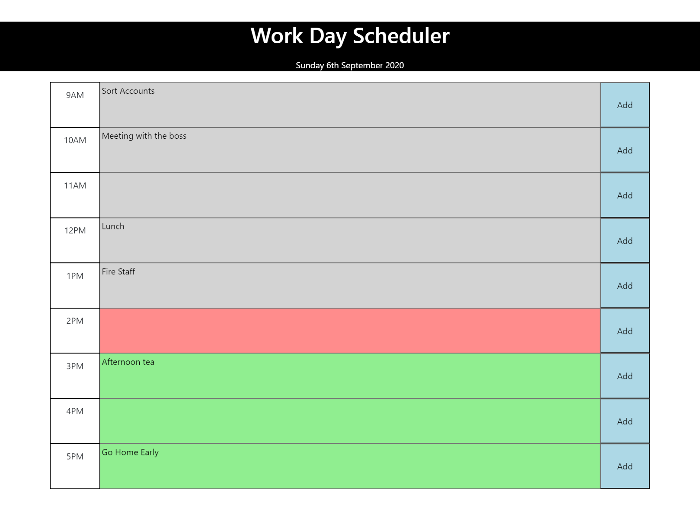

# Work Day Scheduler

## Introduction

A dynamic and responsive daily planner to help employees manage their time effectively during the work day.

## Description

The current day is displayed at the top of the planner using moment.js. As the user scrolls down they are presented with time blocks that are colour coded depending on whether they are in the past, future or present. Users can click into each timeblock and enter an important event. When the add button is clicked for that time block then the event is saved in localStorage for when the page is refreshed or browser is restarted.

## Deployed Link

https://conanas.github.io/work-day-scheduler/

## Screenshot

